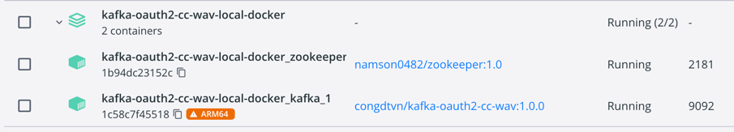
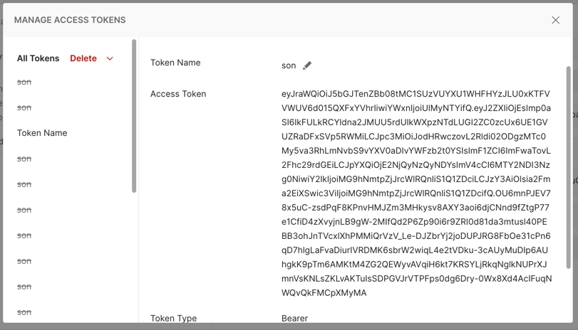
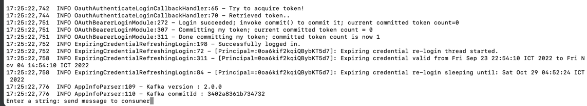
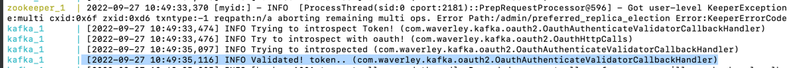
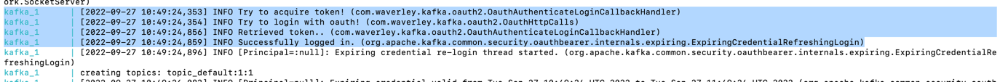

# Kafka OAuth 2.0

## Build up Apache Kafka - Okta - OAuth 2.0

### Register a new account with Okta Server
To register a new account Okta
- Open https://developer.okta.com/signup/ URL to register. Here We use an account as per below
```
Id: cong.dang@waverleysoftware.com
Pass: alibaba123
```

### Build Container for Apache Kafka - Zookeeper
To build Apache Kafka - Zookeeper
- Open folder docker-kafka-zookeeper-server and execute command as per below:
```
docker-compose up
```
- You have to ensure your computer get 2 port as free: 2181 and 9092. After you completed docker-compose then you can see image


## Client X Broker Authentication

### Build the project
To compile java files, please use a command as per below
```
mvn clean compile dependency:copy-dependencies jar:jar
```

### Get an Access Token by Postman

- Here I already setup a account on Okta server as per below:
```
Id: cong.dang@waverleysoftware.com
Pass: alibaba123
```
- Open the Postman and enter the value as per below:
```
Grant Type: Client Credentials
Access Token URL: https://dev-68831743.okta.com/oauth2/aasokta/v1/token
Client ID: 0oa6kif2kqiQBybKT5d7
Client Secret: 0GYiLcM0V23yV8Kngcd5DvVaeuOxJT8r7hPhQ70e
Scope: kafka
Client Authentication: Send as Basic Header
```
- Now, click on "Get New Access Token"


### Configure Environments For Pub/Sub
For client broker authentication, configure this environment variables:

- OAUTH2_ACCESS_TOKEN: use Postman or any tools to get an access token

For Mac

- export OAUTH2_ACCESS_TOKEN=<ACCESS_TOKEN>

For Window

- set OAUTH2_ACCESS_TOKEN=<ACCESS_TOKEN>

### Start Publisher and Consumer
Open 2 terminal window and go to target folder.

- Execute a consumer by command below, remember change path of project folder in command below corresponding to your configuration:
```
./subscriber.sh
```

- Clone your project into a other folder, here I clone it into ready-kafka-oauth2-pub-sub-second folder and execute a publisher by command below, remember change path of project folder in command below corresponding to your configuration:
```
./publisher.sh
```
- Once you start producer successfully


- Some of images show up Apache Kafka and Zookeeper log console, let you know they start them successfully and they have used OAuth 2 already.

